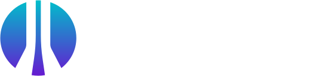
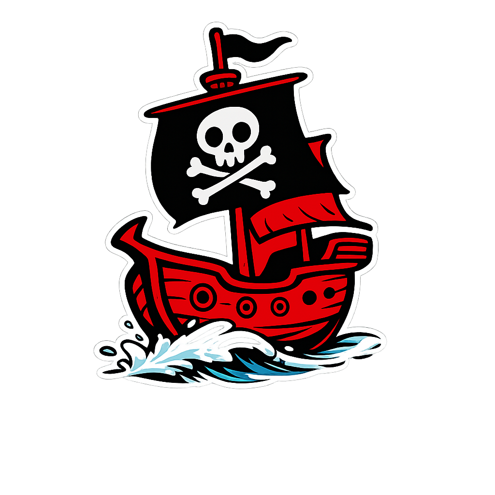

Goldrush Gauntlet 2026 is a **Jeopardy-style Capture-The-Flag solo competition** that will take place **online** on **March 13th-14th, 2026**. To participate, [register here](https://ung.ctfd.io) and join our [Discord server](https://discord.gg/mFA2rRBSKA).

## 📝 Event Details

- 🗓️ **When:** March 13 - March 14, 2026
- 🕘 **Time:** 6PM Friday - 6PM Saturday
- 📍 **Where:** Online

### Eligibility

To compete, you must:
* Be enrolled at a U.S. college or university
* Have an .edu email address

## 🏆 Challenges

Compete **solo** against other students in a great learning experience and test of skill!

A Jeopardy-style Capture-The-Flag competition, including categories such as:
    - 🔒 Cryptography
    - 🕵️ Forensics
    - 🌐 Web Exploitation
    - 📡 Networking
...and **more**.

### Prizes
- 3 Trophies
- 8 Universal CompTIA Exam Vouchers
- 3 Offsec Proving Grounds 1 year
- 15 GGCTF Coins (Shipping address must be in the continental United States)
- and more to come

### Sponsors

******

## ❓ FAQ
***I've never competed can I do this?***
We will have plenty of challenges for beginners and it is a great way to learn cyber. Our goal is to help you learn!

***Can I use AI and LLMs?***

Yes. We are not responsible for helping you debug AI hallucinations.

***Is there any special software I need?***

We recommend installing [VMWare Workstation/Fusion Pro](https://blogs.vmware.com/workstation/2024/05/vmware-workstation-pro-now-available-free-for-personal-use.html) and using the pre-built [Kali virtual machine](https://www.kali.org/get-kali/#kali-virtual-machines) for VMware.

## ✉️  Contact

For any questions, contact [cyberhawks@ung.edu](mailto://cyberhawks@ung.edu) or reach out to @Staff on the [Discord server](https://discord.gg/mFA2rRBSKA)
